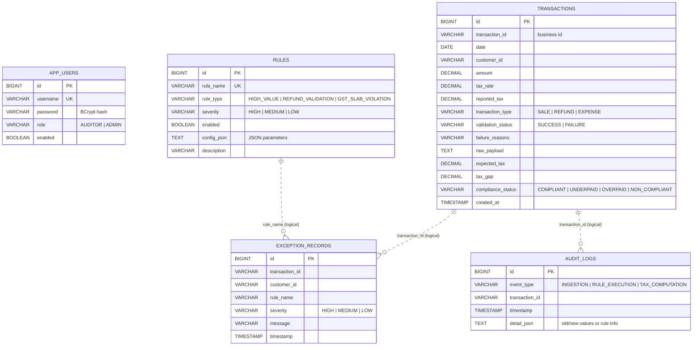

# Database Schema

The schema is created automatically by Hibernate (`ddl-auto=update`) on first
start. The diagram below reflects the JPA entity model.

## Notes on relationships

Exception records and audit logs reference transactions and rules by their
**business identifiers** (`transaction_id`, `rule_name`) rather than hard FK
constraints. This is deliberate: audit/exception rows must remain immutable
historical facts even if a transaction or rule is later changed, and the
ingestion pipeline writes them in high volume. Indexes back the common lookups
(`customer_id`, `severity`, `rule_name`, `transaction_id`, `event_type`).
